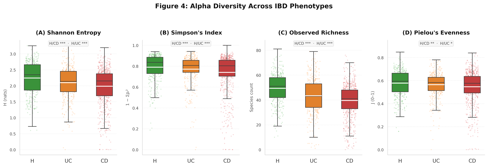
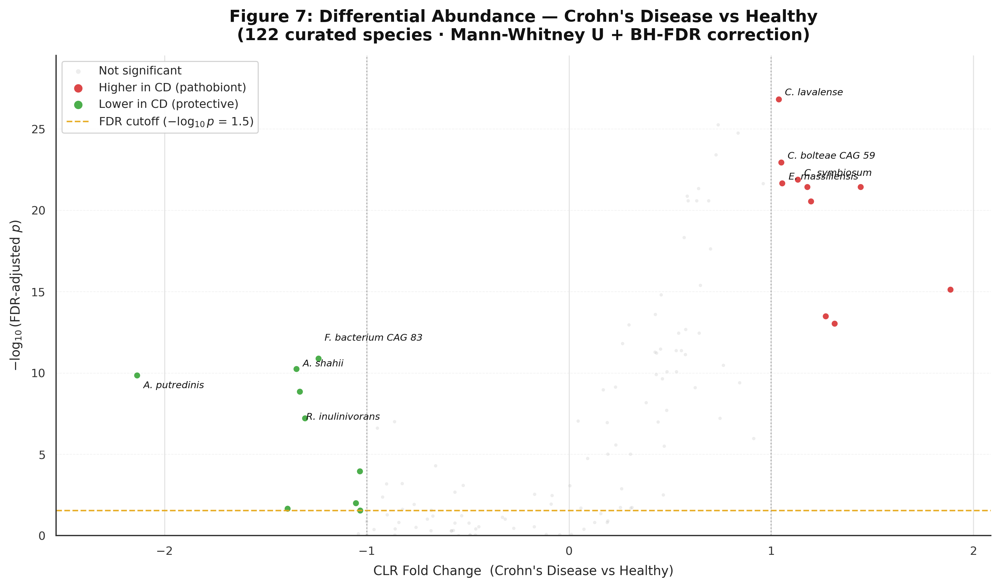
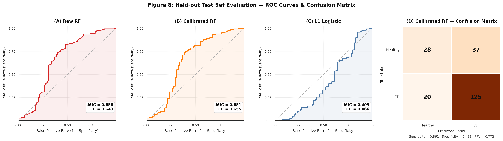
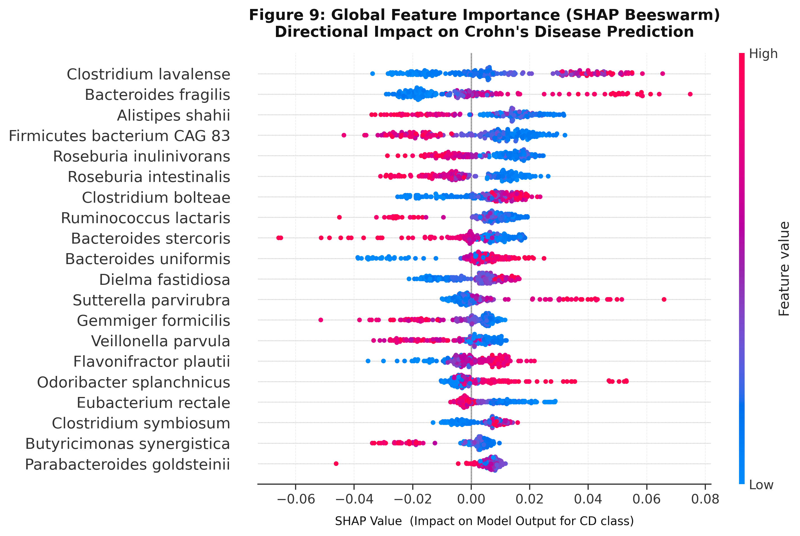
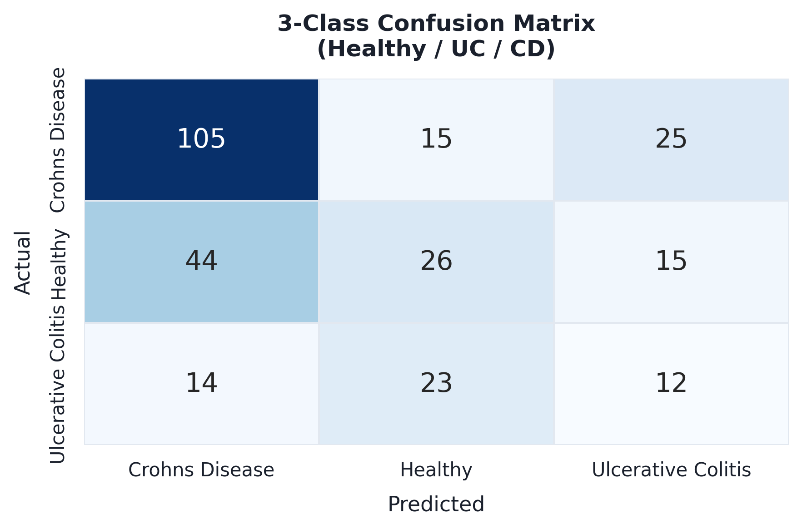
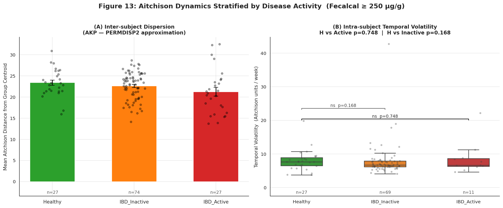
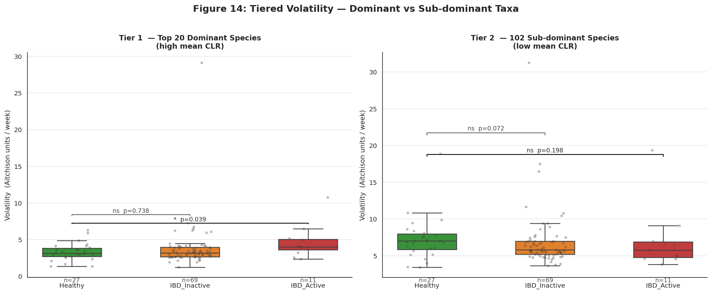
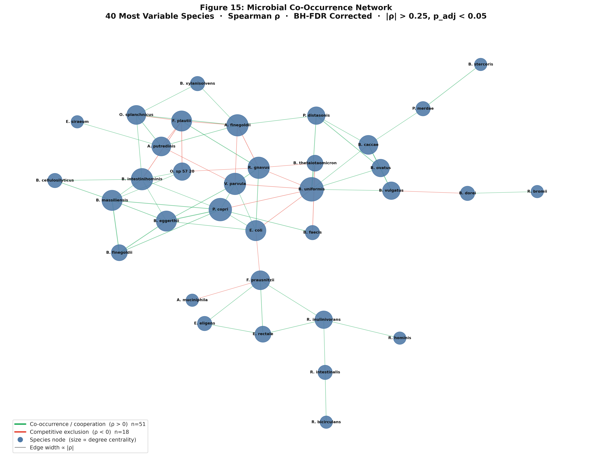

<div align="center">

# Compositionally-Aware Longitudinal Microbiome Analysis for IBD Classification 
### A Reproducible Re-Analysis of the HMP2 IBDMDB Cohort

[](https://colab.research.google.com/github/Shivadzn/hmp2-ibd-metagenomics/blob/main/HMP2_IBD_Longitudinal_Analysis.ipynb)
[](https://doi.org/10.5281/zenodo.XXXXXXX)
[](#)
[](LICENSE)
[](https://www.python.org/)

**Shiva Gupta · AI Data Scientist and Independent Researcher · New Delhi, India**

[](https://github.com/Shivadzn)
[](https://www.linkedin.com/in/shiva-gupta-a70190234/)
[](mailto:shivajaiswaldzn@gmail.com)

</div>

---

## Abstract

Inflammatory bowel disease (IBD), encompassing Crohn's disease (CD)
and ulcerative colitis (UC), is associated with chronic gut microbial
dysbiosis detectable via shotgun metagenomics. Prior machine learning
studies on the HMP2 IBDMDB cohort suffer from non-compositional data
handling, participant-level data leakage, and failure to exploit the
longitudinal sampling structure for which this cohort was explicitly
designed. We present a fully reproducible re-analysis of the complete
IBDMDB metagenomic cohort (116 participants, 1,373 samples) applying
centered log-ratio (CLR) transformation uniformly across all analyses,
participant-stratified GroupKFold cross-validation, and SHAP-based
interpretability. Critically, we exploit the longitudinal structure
discarded by prior work — characterizing individual trajectories in
Aitchison space over 38.5 weeks mean follow-up, stratifying by mucosal
activity via fecal calprotectin (≥250 µg/g), decomposing temporal
volatility across dominant and sub-dominant microbial strata, and
constructing a CLR-based co-occurrence network. Longitudinal analysis
reveals that IBD-associated microbiome instability is episodic rather
than chronic, concentrated in dominant keystone commensals (p=0.039),
and ecologically convergent rather than divergent under active
inflammation — findings invisible to cross-sectional approaches.

---

## Table of Contents

- [Background](#background)
- [Dataset](#dataset)
- [Methodological Contributions](#methodological-contributions)
- [Notebook Structure](#notebook-structure)
- [Key Results](#key-results)
- [Selected Figures](#selected-figures)
- [Biological Conclusions](#biological-conclusions)
- [Repository Structure](#repository-structure)
- [Reproduce the Analysis](#reproduce-the-analysis)
- [Data Access](#data-access)
- [Dependencies](#dependencies)
- [Results Files](#results-files)
- [References](#references)
- [Citation](#citation)
- [License](#license)

---

## Background

The HMP2 Inflammatory Bowel Disease Multi-omics Database (IBDMDB)
is the most comprehensive longitudinal metagenomic resource available
for IBD research, comprising dense stool sampling over a 57-week
follow-up period across Healthy controls, Crohn's Disease (CD), and
Ulcerative Colitis (UC) participants. Despite its explicit longitudinal
design, prior machine learning studies on this cohort — most notably
Miranda et al. (2019) and Acharjee et al. (2024) — have treated it
as a cross-sectional dataset, discarding temporal information entirely.

Beyond the longitudinal gap, both prior studies suffer from two
additional methodological limitations. First, neither applies
compositional data analysis: raw relative abundances are constrained
to sum to a constant, violating the independence assumptions of
standard statistical and ML methods and introducing spurious
correlations. Second, both evaluate models using sample-level data
splits, allowing the same participant's microbiome to appear in both
training and test sets — inflating performance metrics by memorising
individual gut signatures rather than learning generalisable disease
patterns.

Most recently, Laccourreye et al. (2022) applied Dynamic Bayesian
Networks to the IBDMDB multi-omic dataset — the only prior study to
exploit longitudinal structure for ML modelling. However, their
analysis did not apply compositional data transformation, did not
address participant-level leakage, and performed no
inflammation-stratified ecological analysis.

This repository addresses all three limitations jointly and introduces
a novel longitudinal analysis framework that is, to our knowledge,
the first compositionally correct, inflammation-stratified,
participant-leakage-free re-analysis of the IBDMDB cohort.

---

## Dataset

| Property | Value |
|---|---|
| **Source** | HMP2 IBDMDB — https://ibdmdb.org |
| **Total rows (raw)** | 3,387 (includes 2,014 duplicate entries) |
| **Unique samples** | 1,373 (deduplicated on External ID) |
| **Participants** | 116 total · Healthy=27 · CD=56 · UC=33 |
| **Samples per participant** | mean=29.2 · min=1 · max=67 |
| **Study design** | 57-week longitudinal follow-up |
| **Mean follow-up** | 38.5 weeks per participant |
| **Mean visits** | 11.8 unique timepoints per participant |
| **Visit frequency** | every ~3.8 weeks |
| **Taxa profiled** | 566 MetaPhlAn3 species-level features |
| **Species detected/sample** | mean=51 of 566 |
| **Matrix sparsity** | 91.0% zeros — expected for metagenomics |
| **Fecalcal availability** | 1,360 / 3,387 rows (40.2%) |
| **Fecalcal range** | 3.6 – 493.7 µg/g |
| **Fecalcal mean — Healthy** | 36 µg/g |
| **Fecalcal mean — CD** | 134 µg/g |
| **Fecalcal mean — UC** | 148 µg/g |
| **Primary reference** | Lloyd-Price et al. (2019) Nature 569:655–662 |

---

## Methodological Contributions

11 citation factors extending Miranda et al. (2019) and
Acharjee et al. (2024):

| CF | Contribution | Miranda 2019 | Acharjee 2024 | This Work |
|---|---|---|---|---|
| **CF 1** | Prevalence filter | Not reported | Not reported | 10% threshold → 122 species |
| **CF 2** | Participant filter | N/A | N/A | ≥5 timepoints for trajectory subset |
| **CF 3** | Class balance | Not reported | Not reported | Stratified sampling · F1_macro |
| **CF 4** | Compositional transform | Raw abundances | CLR (ML only) | CLR uniformly across all analyses |
| **CF 5** | Beta diversity | Not reported | Standard | Aitchison PCA in CLR space |
| **CF 6** | Clinical validation | None | None | Dysbiosis score vs fecalcal ρ=0.167 |
| **CF 7** | Cross-validation | Row-level split | Standard k-fold | GroupKFold(5) by Participant ID |
| **CF 8** | Longitudinal trajectories | No cross-sectional | No cross-sectional | Aitchison space · 38.5 weeks |
| **CF 9** | AKP + fecalcal stratification | No | No | convergent dysbiosis finding |
| **CF 10** | Tiered volatility decomposition | No | No | p=0.039 keystone instability |
| **CF 11** | Co-occurrence network | No | No | 35 nodes · B. uniformis hub |

---

## Notebook Structure

| Part | Analysis | Key Output |
|---|---|---|
| **Part 0** | Environment setup | Libraries · seed · colour palette |
| **Part 1** | Data loading | Raw CSV → metadata + species columns |
| **Part 2** | Dataset orientation | Shape · participants · temporal structure · sparsity · fecalcal |
| **Part 3** | Dataset curation | Dedup · zero removal · prevalence filter · fecalcal imputation · two datasets · class balance |
| **Part 4** | CLR transformation | Row mean ~0 verified (5.67×10⁻¹⁷) · adaptive pseudocount |
| **Part 5** | Alpha diversity | Shannon · Simpson · Richness · Pielou — all four metrics significant |
| **Part 6** | Aitchison ordination | PCA on CLR · PC1-3 explain 22.2% variance · phenotype separation |
| **Part 7** | Dysbiosis score | Pathobiont:symbiont CLR ratio · fecalcal validation ρ=0.167 |
| **Part 8** | Differential abundance | Mann-Whitney U + BH-FDR · 122 species · 3 comparisons |
| **Part 9A** | Binary ML (H vs CD) | Balanced RF + Calibrated RF + L1 LR · GroupKFold · F1=0.643 |
| **Part 9B** | 3-class ML (H vs UC vs CD) | F1_macro=0.423 · UC→Healthy confusion confirms colon-limited biology |
| **Part 10** | SHAP + phylum analysis | Directional attribution · 20-species minimum viable biomarker panel |
| **Part 11A** | Longitudinal trajectories | Individual Aitchison space trajectories · qualitative AKP motivation |
| **Part 11B** | Inflammation-stratified dynamics | Fecalcal-stratified AKP dispersion + Aitchison velocity |
| **Part 11C** | Tiered volatility decomposition | Dominant vs sub-dominant taxa · p=0.039 keystone instability |
| **Part 11D** | Diagnosis-level volatility | Kruskal-Wallis + MWU across H/CD/UC · episodic instability confirmed |
| **Part 12** | Co-occurrence network | CLR Spearman · 35 nodes · 69 edges · B. uniformis hub |
| **Part 13** | Results export + citation summary | 21 CSVs · 11-factor contribution summary |
| **Part 14** | Biological conclusions | 8 findings · limitations · future directions |

---

## Key Results

### Machine Learning Performance

#### Binary Classification — Healthy vs Crohn's Disease

| Model | F1_macro | AUC | Healthy F1 | CD F1 | Accuracy |
|---|---|---|---|---|---|
| Raw Balanced RF | 0.643 | 0.658 | 0.47 | 0.81 | 0.72 |
| **Calibrated RF** | **0.655** | **0.651** | **0.50** | **0.81** | **0.73** |
| L1 Logistic Regression | 0.467 | 0.409 | 0.24 | 0.70 | 0.57 |

*Held-out test set — unseen participants only · GroupKFold(5) by Participant ID*

The Calibrated RF is the best-performing model (F1_macro=0.655,
AUC=0.651). CD classification is substantially stronger than Healthy
(F1=0.81 vs 0.50), reflecting the larger CD class size (145 vs 65
test samples) and the more pronounced compositional divergence of CD
from the community centroid. L1 Logistic Regression underperforms
substantially (F1_macro=0.467), consistent with IBD microbiome
decision boundaries being non-linear in CLR space.

---

#### 3-class Classification — Healthy vs UC vs CD

| Model | F1_macro | Healthy F1 | UC F1 | CD F1 |
|---|---|---|---|---|
| Balanced RF | 0.423 | — | 0.24 | — |

*Absolute drop from binary to 3-class: 0.232 F1_macro points*

The largest source of degradation is UC, which achieves F1=0.24.
The confusion matrix reveals the key biological finding: UC
misclassifies toward Healthy (23 samples) more than toward CD
(14 samples), confirming that UC gut microbiome at the species
level is more similar to Healthy than to CD.

**Biological interpretation:** UC is restricted to the colon
mucosa, producing a relatively preserved luminal microbiome
compared to CD, which involves transmural inflammation across
the entire GI tract. MetaPhlAn3 species-level profiling of stool
captures luminal community composition — making CD-Healthy
discrimination far easier than UC-Healthy discrimination.

**Implication for Miranda et al. (2019):** Miranda attempted
6-group stratification (CD, CDD, UC, UCD, nonIBD, nonIBDD) on
70 participants without CLR transformation or participant-stratified
evaluation. Our results on 116 participants with methodologically
correct implementation show that even the 3-class problem is
challenging (F1_macro=0.423). Miranda's 6-class results should
be interpreted with significant caution.

**Clinical implication:** Reliable UC classification likely
requires strain-level resolution, mucosal biopsy metagenomics
rather than stool profiling, or integration with host
transcriptomics or metabolomics — a concrete direction for
future work.

---

#### Minimum Viable Biomarker Panel (SHAP-selected)

| Panel | Species | F1_macro | Drop |
|---|---|---|---|
| Full model | 122 | 0.643 | — |
| **Lean SHAP panel** | **20** | **0.566** | **−0.077 (12.0%)** |

Predictive signal is concentrated in the top 20 SHAP-attributed
species. An absolute F1 drop of 0.077 across an 83.6% feature
reduction confirms that the remaining 102 species contribute
noise rather than signal. The 20-species panel is clinically
actionable — testable with targeted qPCR panels — though
external validation is required before clinical deployment.

### Alpha Diversity

| Metric | Healthy | UC | CD | Cohen's d (H/CD) | p (H/CD) |
|---|---|---|---|---|---|
| Observed Richness | 49.38±12.11 | 43.40±14.55 | 39.54±13.26 | **+0.765** | 6.16×10⁻²⁹ *** |
| Shannon Entropy | 2.242±0.518 | 2.096±0.517 | 1.985±0.594 | **+0.451** | 1.08×10⁻¹¹ *** |
| Simpson's Index | 0.790±0.132 | 0.771±0.138 | 0.740±0.186 | **+0.300** | 9.04×10⁻⁰⁷ *** |
| Pielou's Evenness | 0.578±0.116 | 0.565±0.110 | 0.546±0.144 | **+0.235** | 2.98×10⁻⁰³ ** |

*Mann-Whitney U, two-sided · *** p<0.001 · ** p<0.01 · * p<0.05*

### Longitudinal Analysis

| Analysis | Result | p-value |
|---|---|---|
| Aggregate Aitchison velocity (H vs IBD_Active) | No significant difference | 0.748 (ns) |
| **Tier 1 keystone taxa volatility (H vs IBD_Active)** | **Significantly elevated in active IBD** | **0.039 (*)** |
| Tier 2 sub-dominant taxa volatility | No significant difference | 0.198 (ns) |
| Diagnosis-level omnibus (H vs CD vs UC) | No significant difference | 0.379 (ns) |
| AKP dispersion — Healthy vs IBD_Active | 23.38 vs 21.24 Aitchison units | Convergent dysbiosis |

### Co-occurrence Network

| Metric | Value |
|---|---|
| Connected nodes | 35 |
| Significant edges | 69 (51 positive · 18 negative) |
| Positive:negative ratio | 3:1 — cooperation dominates |
| Network density | 0.116 |
| Average clustering coefficient | 0.375 |
| Connected components | 1 (fully connected) |
| Highest hub | *Bacteroides uniformis* (degree=9) |
| IBD-relevant hub | *Ruminococcus gnavus* (degree=7) |

---

## Selected Figures

### Alpha Diversity — Ecological Collapse Across IBD Phenotypes
*Four complementary metrics confirm significant community-wide
diversity reduction following the gradient Healthy > UC > CD.
Species richness shows the largest effect (p=6.16×10⁻²⁹, d=0.765).*



---

### CLR Transformation — Compositional Correction
*Panel A: zero-inflated raw abundances of F. prausnitzii.
Panel B: near-Normal CLR distribution confirming successful
removal of compositional artifacts and left skew consistent
with CD-associated depletion.*


---

### Differential Abundance — CD vs Healthy
*BH-FDR corrected Mann-Whitney U across 122 CLR-transformed
species. F. prausnitzii depletion and R. gnavus enrichment
in CD are confirmed — consistent with published IBD biomarkers.*



---

### Binary Classification — ROC and Confusion Matrix (H vs CD)
*Balanced Random Forest under GroupKFold(5) participant-stratified
evaluation. F1_macro=0.643, AUC=0.655 — honest out-of-sample
estimates with zero participant leakage.*



---

### SHAP Biomarker Panel — Directional Feature Attribution
*Top 20 species by mean |SHAP| value. Colour encodes direction:
CD-enriched vs CD-depleted. B. fragilis shows discordant signal
consistent with known enterotoxigenic vs non-toxigenic strain
heterogeneity unresolvable at species level.*



---

### 3-class Confusion Matrix — UC Resembles Healthy More Than CD
*UC misclassified as Healthy (23/49) more than as CD (14/49),
confirming colon-limited UC pathophysiology at the species level.
This pattern is a biological finding, not a modelling failure.*



---

### Figure 13 — Inflammation-Stratified Aitchison Dynamics
*Panel A: AKP inter-subject dispersion decreases monotonically
from Healthy to IBD_Active — convergent rather than divergent
dysbiosis, contrary to the classical Anna Karenina prediction.
Panel B: aggregate temporal volatility is non-significant
(p=0.748), motivating tiered decomposition in Figure 14.*



---

### Figure 14 — Tiered Volatility Decomposition
*Dominant keystone taxa (Tier 1: top 20 species by mean CLR)
show significantly elevated volatility in IBD_Active vs Healthy
(p=0.039). Sub-dominant taxa (Tier 2: 102 species) show no
significant difference — IBD instability is localised, not
community-wide. This dissociation is only visible through
tiered decomposition.*



---

### Figure 15 — Microbial Co-occurrence Network
*CLR Spearman network (35 nodes · 69 edges · BH-FDR corrected
|ρ|>0.25). Green = co-occurrence · Red = competitive exclusion.
Node size ∝ degree centrality. B. uniformis is the highest hub
(degree=9). R. gnavus (known CD pathobiont) maintains degree=7
across pooled samples — ecologically integrated, not invasive.*



---

## Biological Conclusions

**Finding 1 — Ecological collapse is measurable**
CD and UC show significantly reduced alpha diversity across all four
metrics (species richness: p=6.16×10⁻²⁹, d=0.765), indicating
large-magnitude ecological collapse consistent with Gevers et al. (2014).

**Finding 2 — Compositional space separates community states**
Aitchison ordination reveals compact Healthy clusters vs diffuse CD
regions. PC1-3 explain 22.2% of total compositional variance.

**Finding 3 — SHAP confirms known biology**
Top features include *F. prausnitzii*, *Gemmiger formicilis*,
*C. lavalense*, and *F. plautii* — consistent with published IBD
biomarkers. *B. fragilis* shows discordant signals consistent with
known strain-level heterogeneity.

**Finding 4 — GroupKFold gives honest estimates**
Participant-stratified evaluation prevents memorisation of individual
gut signatures. Row-level splits as used by Miranda et al. inflate
performance by allowing the same participant in both train and test sets.

**Finding 5 — Microbiome instability is episodic, not chronic**
Aggregate volatility is non-significant (p=0.748). Tiered
decomposition reveals keystone taxa instability specifically in
active IBD (p=0.039). Diagnosis-level analysis confirms no chronic
effect (p=0.379). This three-layer finding is invisible to
cross-sectional analysis.

**Finding 6 — Classical AKP prediction does not hold**
IBD_Active shows lower inter-subject dispersion than Healthy
(21.24 vs 23.38 Aitchison units), indicating convergent rather
than divergent dysbiosis under active inflammation.

**Finding 7 — UC microbiome resembles Healthy more than CD**
3-class classifier misclassifies UC→Healthy (23/49) more than
UC→CD (14/49), consistent with colon-limited UC pathophysiology.

**Finding 8 — Co-occurrence network reveals integrated pathobionts**
*R. gnavus* (known CD pathobiont) maintains high network centrality
(degree=7) across pooled samples — ecologically integrated rather
than newly introduced during disease.

---

## Repository Structure

```text
HMP2_IBD_Microbiome_Longitudinal_Analysis/
├── README.md
├── LICENSE
├── CITATION.cff
├── requirements.txt
├── HMP2_IBD_Longitudinal_Analysis.ipynb
│
├── data/
│   └── README.md
│
├── results/
│   ├── alpha_diversity_per_sample.csv
│   ├── alpha_diversity_summary.csv
│   ├── beta_diversity_pca_coordinates.csv
│   ├── beta_diversity_pca_variance.csv
│   ├── differential_abundance_CD_vs_Healthy.csv
│   ├── differential_abundance_UC_vs_Healthy.csv
│   ├── differential_abundance_CD_vs_UC.csv
│   ├── shap_feature_importance_binary.csv
│   ├── shap_biomarker_panel_top20.csv
│   ├── shap_feature_importance_3class.csv
│   ├── model_performance.csv
│   ├── model_performance_binary_folds.csv
│   ├── model_summary_binary.csv
│   ├── model_summary_3class.csv
│   ├── model_performance_3class_folds.csv
│   ├── model_classification_report_3class.csv
│   ├── temporal_volatility_activity_stratified.csv
│   ├── tiered_volatility_dominant_subdominant.csv
│   ├── akp_dispersion.csv
│   ├── cooccurrence_network_edges.csv
│   └── network_hub_species.csv
│
└── figures/
    ├── figure01_dataset_orientation.png
    ├── figure02_prevalence_filter.png
    ├── figure03_clr_transformation.png
    ├── figure04_alpha_diversity.png
    ├── figure05_aitchison_ordination.png
    ├── figure06_dysbiosis_score.png
    ├── figure07_dysbiosis_fecalcal.png
    ├── figure08_volcano_cd_vs_healthy.png
    ├── figure09_roc_confusion_matrix.png
    ├── figure10_shap_beeswarm.png
    ├── figure11_shap_phylum.png
    ├── figure12_3class_confusion.png
    ├── figure13_trajectory_3d.png
    ├── figure14_aitchison_dynamics.png
    ├── figure15_tiered_volatility.png
    └── figure16_cooccurrence_network.png
```

## Reproduce the Analysis

### Option A — Google Colab (recommended, zero setup)

[](https://colab.research.google.com/github/Shivadzn/HMP2_IBD_Microbiome_Longitudinal_Analysis/blob/main/notebook/HMP2_IBD_Microbiome_Longitudinal_Analysis.ipynb)

### Option B — Local environment

```bash
git clone https://github.com/Shivadzn/HMP2_IBD_Microbiome_Longitudinal_Analysis
cd HMP2_IBD_Microbiome_Longitudinal_Analysis
pip install -r requirements.txt
```

Download data following `data/README.md`, then:

```bash
jupyter notebook HMP2_IBD_Longitudinal_Analysis.ipynb
```

---

## Data Access

Raw data available from the HMP2 IBDMDB portal:

**https://ibdmdb.org/results**

Files required:
- `hmp2_metadata.tsv`
- `taxonomic_profiles.tsv` (MetaPhlAn3 species-level)

Data is not included in this repository due to file size and
HMP2 data access terms. See `data/README.md` for detailed
download and placement instructions.

---

## Dependencies & Environment

This project requires a Python environment running version **3.9+**. All required third-party libraries can be installed directly from the included `requirements.txt` manifest:

```bash
pip install -r requirements.txt
```
---

## Results Files

| File | Description | Part |
|---|---|---|
| `alpha_diversity_per_sample.csv` | Per-sample Shannon · Simpson · Richness · Pielou | Part 5 |
| `alpha_diversity_summary.csv` | Group-level mean ± SD per metric | Part 5 |
| `beta_diversity_pca_coordinates.csv` | PC1-5 coordinates per sample | Part 6 |
| `beta_diversity_pca_variance.csv` | Variance explained per PC | Part 6 |
| `differential_abundance_CD_vs_Healthy.csv` | DA results with BH-FDR | Part 8 |
| `differential_abundance_UC_vs_Healthy.csv` | DA results with BH-FDR | Part 8 |
| `differential_abundance_CD_vs_UC.csv` | DA results with BH-FDR | Part 8 |
| `shap_feature_importance_binary.csv` | Full SHAP importance — binary model | Part 10 |
| `shap_biomarker_panel_top20.csv` | Top 20 species — minimum viable panel | Part 10 |
| `shap_feature_importance_3class.csv` | SHAP importance — 3-class model | Part 9B |
| `model_performance.csv` | Unified model performance summary | Part 13 |
| `model_performance_binary_folds.csv` | Per-fold binary CV results | Part 9A |
| `model_summary_binary.csv` | Binary model mean ± SD summary | Part 9A |
| `model_summary_3class.csv` | 3-class model + UC confusion pattern | Part 9B |
| `model_performance_3class_folds.csv` | Per-fold 3-class CV F1 | Part 9B |
| `model_classification_report_3class.csv` | Precision · recall · F1 per class | Part 9B |
| `temporal_volatility_activity_stratified.csv` | Per-participant Aitchison velocity | Part 11B |
| `tiered_volatility_dominant_subdominant.csv` | Tier 1 + Tier 2 volatility | Part 11C |
| `akp_dispersion.csv` | AKP inter-subject dispersion per group | Part 11B |
| `cooccurrence_network_edges.csv` | Edge list with ρ sign + weight | Part 12 |
| `network_hub_species.csv` | Hub species by degree centrality | Part 12 |

---

## References

| Citation | Journal | DOI |
|---|---|---|
| Miranda et al. (2019) | F1000Research | 10.12688/f1000research.15091.2 |
| Acharjee et al. (2024) | BBA Mol. Basis Dis. | 10.1016/j.bbadis.2024.167618 |
| Laccourreye et al. (2022) | Mathematics | 10.3390/math10121994 |
| Lloyd-Price et al. (2019) | Nature | 10.1038/s41586-019-1237-9 |
| Gloor et al. (2017) | Front. Microbiology | 10.3389/fmicb.2017.02224 |
| Zaneveld et al. (2017) | Nature Microbiology | 10.1038/nmicrobiol.2017.121 |
| Gevers et al. (2014) | Cell Host & Microbe | 10.1016/j.chom.2014.02.005 |
| Lundberg & Lee (2017) | NeurIPS | — |
| Anderson (2006) | Biometrics | 10.1111/j.1541-0420.2005.00440.x |
| Aitchison (1982) | J. Royal Stat. Soc. B | 10.1111/j.2517-6161.1982.tb01195.x |
| Sipponen & Kolho (2015) | Scand. J. Gastroenterol. | 10.3109/00365521.2014.987809 |
| Sokol et al. (2008) | PNAS | 10.1073/pnas.0804812105 |
| Hall et al. (2017) | Genome Medicine | 10.1186/s13073-017-0490-5 |
| Faust & Raes (2012) | Nat. Rev. Microbiology | 10.1038/nrmicro2832 |
| Park & Plantinga (2023) | Genes | 10.3390/genes14010218 |
| Lozupone et al. (2012) | Nature | 10.1038/nature11550 |
| Franzosa et al. (2019) | Nature Microbiology | 10.1038/s41564-018-0306-4 |

---

## Citation

If you use this work please cite:

```bibtex
@software{shivagupta2026hmp2ibd,
  author    = {Shiva Gupta},
  title     = {Compositionally-Aware Longitudinal Microbiome
               Analysis for IBD Classification: A Reproducible
               Re-Analysis of the HMP2 IBDMDB Cohort},
  year      = {2026},
  publisher = {Zenodo},
  doi       = {10.5281/zenodo.XXXXXXX},
  url       = {https://doi.org/10.5281/zenodo.XXXXXXX}
}
```

A `CITATION.cff` file is included for automated citation
via GitHub and Zenodo.

---

## Author

**Shiva Gupta**
AI Data Scientist and Independent Researcher | New Delhi, India

[](https://github.com/Shivadzn)
[](https://www.linkedin.com/in/shiva-gupta-a70190234/)
[](mailto:shivajaiswaldzn@gmail.com)

---

## License

MIT — see [LICENSE](LICENSE) file.

---

<div align="center">

*Data: HMP2 IBDMDB — https://ibdmdb.org (NIH Human Microbiome Project)*

*If you find this work useful, please consider starring
the repository and citing the preprint.*

</div>
